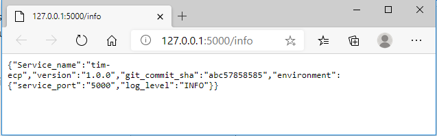
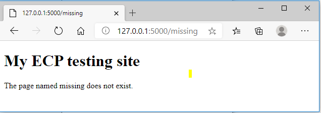

#  HOWTO Guides

## Prerequisites

*   docker
*   docker compose
*   make
*   python
*   pip
*   git

### Setting up your verification environment

>   Download [anz-ecp/tim-lim ](https://github.com/anz-ecp/tim-lim )repository
>   from GitHub to the local environment (and navigate to the downloaded folder
>   through the command line).

```bash
$ git clone <https://github.com/anz-ecp/tim-lim>
$ cd tim-lim
```
### Build, Deploy and Start the application

A `Dockerfile` which defines all the software requirements is provided to allow
portable build of the test environment. All required python modules are defined
in the `requirements.txt` file. In fact, this test code was fully developed on 
Windows 10 setting and successfully verified on a RedHat 7 AWS EC2 instance for
portability.

To build, deploy and start the test application, run command:

```bash
$ make install
```
This will invoke the `docker-compose` command to build the required docker
image defined in the `docker-compose.yml` file.

```bash
   C:.
   │ Makefile
   │ README.md
   │
   ├───app
   │ .dockerignore
   │ app.py
   │ requirements.txt 
   │
   └───deployments
   │ docker-compose.yml
   │
   └───app
           Dockerfile
```
Content of `docker-compose.yml` file:

```bash
version: "2"
services:
  app:
    container_name: tim-ecp
    build:
      context: ../
      dockerfile: deployments/app/Dockerfile
    ports:
      - "5000:5000"
    environment:
     - service_port=5000
     - log_level=INFO    
```

The two stated required environment variables `service_port` and `log_level`
which are passed into the application during the build process.

**Notes:**

The `ports` and `service_port` must match for the application to receive its
network traffic. `ports` `(5000:5000)` is used to define host to container port mapping,
that is all traffic on host port `5000` will be directed to container port
`5000`. The `service_port` is what the application will listen for incoming
requests.

The `log_level` must be set to `INFO` level to allow `Flask` `logger` to display
the required logged `/info` events, which is output to `STDOUT` in structured data
format. The application is designed to ONLY output `/info` request events on purpose to ease
verifcation of this requirement. The `Flask` `logger` is being leveraged to allow
easy manipulate with minimise code change later, if logs retention is required.

###  Verify deployment of container

Run `docker images list` command to display `docker-compose` auto assigned
image named `deployments_app`

```bash
$ docker image list –format "table{{.ID}}\\t{{.Repository}}\\t{{.Tag}}"
```
```bash
   IMAGE ID     REPOSITORY      TAG
   7fc06620e0af deployments_app latest
   28a4c88cdbbf python          3
```

Run `docker ps` command to display the started container named `tim-ecp` which
is defined in  the `docker-compose.yml`

```bash
$ docker ps --format "table{{.ID}}\\t{{.Image}}\\t{{.Names}}\\t{{.Ports}}"
```

```bash
CONTAINER ID IMAGE           NAMES   PORTS
cf95f6b31042 deployments_app tim-ecp 0.0.0.0:5000-\>5000/tcp
```

### Verify Test Result

Run `docker start` command to run an interactive terminal session against
the running container to verify that the `/info` endpoint access request 
is being reported in structured data format.

```bash
$ docker start -i tim-ecp
```

**You may see nothing until the `/info` endpoint is being accessed.**

Leave this session alone as the application is written, with pupose, to
only report `/info` API endpoint requests.

When you access the <http://127.0.0.1:5000/info> through a Web Client, you
should see:



Output data is in **`JSON` format.**

Back to the terminal session where you have started `docker start` command
earlier, you should start to see the access to `/info` endpoint is being
reported in **structured data format**. One line per access request.


When you access any other undefined endpoint, for example,
<http://127.0.0.1:5000/missing> through the same Web Client, you should see a
response advising the endpoint does not exist



## Module level Testing conducted

### Prerequisites

These software must be installed on your test host

*  python 
*  pip

### Install required python modules into local environment

```bash
$ pip install -r app/requirements.txt
```

### Start the test application

```bash
$ python app/app.py
```
The verification steps from WEB client provided in the previous section can be used.

## Development Environment

This piece of development was built entirely on a window 10 desktop involving
the following components:

*   Visual Studio Code Editor and various plugins
*   Docker Desktop for windows
*   Docker Compose
*   powershell
*   git client
*   make
*   python
*   pip

The on premises infrastructure (an aged 5 years old laptop computer) has turned
out being a real winner in term of cost for compute and data storage as compared
to the cloud option or the efforts would be required to spin up a virtual unix VM. 
The only petty cloud usage cost **(probably under a dollar this month)** for 
the few minutes of portability test on an `AWS EC2 instance`.

## Possible Code Enhancements 

*   Rendering the `/info` API endpoint JSON output for better visual effect
*   Enable Token Authorization for endpoint access

#  Hope you like my code!!! 
